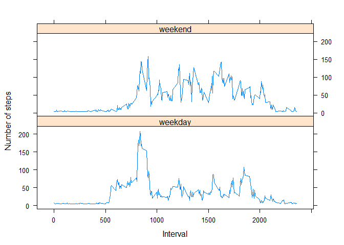

# Reproducible Research: Peer Assessment 1


## Loading and preprocessing the data


```r
if (!file.exists("activity.csv")) {
    unzip("activity.zip")
}

activity <- read.csv("activity.csv")
activity$date <- as.Date(activity$date, "%Y-%m-%d")
```

## What is mean total number of steps taken per day?

1. Calculate the total number of steps taken per day


```r
TotalSteps <- aggregate(steps ~ date, data = activity, sum, na.rm= TRUE)

head (TotalSteps)
```

```
##         date steps
## 1 2012-10-02   126
## 2 2012-10-03 11352
## 3 2012-10-04 12116
## 4 2012-10-05 13294
## 5 2012-10-06 15420
## 6 2012-10-07 11015
```

2. Histogram of the total number of steps taken each day


```r
hist(TotalSteps$steps, main = "Histogram of Total steps by day", xlab = "Total Steps by day",col = "green",ylim = c(0,30))
```

 

3. Mean and median of the total number of steps taken per day


```r
mean(TotalSteps$steps)
```

```
## [1] 10766.19
```

```r
median(TotalSteps$steps)
```

```
## [1] 10765
```

## What is the average daily activity pattern?

1. Make a time series plot (i.e. type = "l") of the 5-minute interval (x-axis) and the average number of steps taken, averaged across all days (y-axis)


```r
Intervals <- aggregate(steps ~ interval, data = activity, FUN = mean)
plot(Intervals, type = "l", col = "blue", xlab = "5-min interval",ylab = "Average across all Days", main = "Average number of steps")
```

 

2. Which 5-minute interval, on average across all the days in the dataset, contains the maximum number of steps?


```r
Intervals$interval[which.max(Intervals$steps)]
```

```
## [1] 835
```

## Imputing missing values

1. Calculate and report the total number of missing values in the dataset (i.e. the total number of rows with NAs)


```r
sum(is.na(activity))
```

```
## [1] 2304
```

2. Devise a strategy for filling in all of the missing values in the dataset. The strategy does not need to be sophisticated. For example, you could use the mean/median for that day, or the mean for that 5-minute interval, etc.

I will use the strategy to fill each NA value by the mean of the steps attribute.


3. Create a new dataset that is equal to the original dataset but with the missing data filled in.


```r
# create a copy of the dataset
newdata <- activity

# Find the missing values positions
na_pos <- which(is.na(newdata$steps))

# Create a vector of means
mean_vec <- rep(mean(newdata$steps, na.rm=TRUE), times=length(na_pos))

# Replace the NAs by the mean
newdata[na_pos, "steps"] <- mean_vec

head(newdata)
```

```
##     steps       date interval
## 1 37.3826 2012-10-01        0
## 2 37.3826 2012-10-01        5
## 3 37.3826 2012-10-01       10
## 4 37.3826 2012-10-01       15
## 5 37.3826 2012-10-01       20
## 6 37.3826 2012-10-01       25
```
4. Make a histogram of the total number of steps taken each day and Calculate and report the mean and median total number of steps taken per day.Do these values differ from the estimates from the first part of the assignment? What is the impact of imputing missing data on the estimates of the total daily number of steps?


```r
TotalSteps <- aggregate(steps ~ date, data = newdata, sum)
hist(TotalSteps$steps, main = "Histogram of Total steps by day\n(NA replaced by mean value)", xlab = "Total Steps by day",col = "green",ylim = c(0,40))
```

 

```r
mean(TotalSteps$steps)
```

```
## [1] 10766.19
```

```r
median(TotalSteps$steps)
```

```
## [1] 10766.19
```

Filling the missing values with the mean of the steps did not change the values of mean and median meaningly.

Old Values          

mean   10766.19
median 10765

New Values

mean   10766.19
median 10766.19

## Are there differences in activity patterns between weekdays and weekends?

For this part the weekdays() function may be of some help here. Use the dataset with the filled-in missing values for this part.

1. Create a new factor variable in the dataset with two levels - "weekday" and "weekend" indicating whether a given date is a weekday or weekend day.


```r
day_type <- function(date) {
    if (weekdays(as.Date(date)) %in% c("Saturday", "Sunday")) {
        "weekend"
    } 
    else {
        "weekday"
    }
}

newdata$daytype <- as.factor(sapply(newdata$date, day_type))
```

2. Make a panel plot containing a time series plot (i.e. type = "l") of the 5-minute interval (x-axis) and the average number of steps taken, averaged across all weekday days or weekend days (y-axis). See the README file in the GitHub repository to see an example of what this plot should look like using simulated data.


```r
NumberSteps <- aggregate( data=newdata, steps ~ daytype + interval, FUN=mean )

library(lattice)

xyplot( type="l", data=NumberSteps, steps ~ interval | daytype, 
        xlab="Interval", ylab="Number of steps", layout=c(1,2)
      )
```

 
